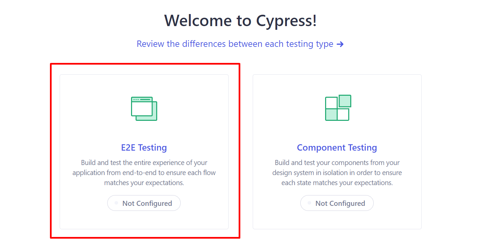
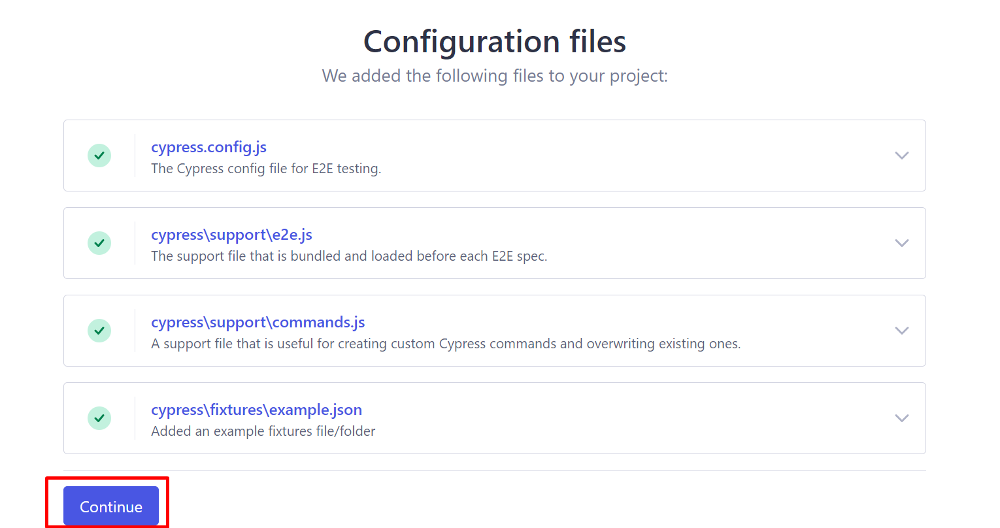
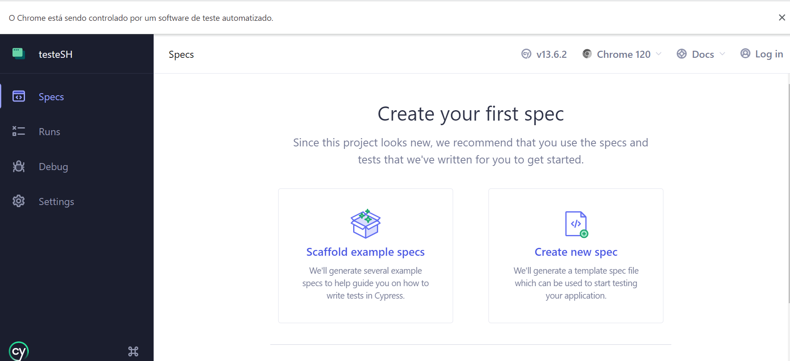

# Visual Regression Tracker with Cypress

## Prerequisites for this project

## Environment configuration

### **Enable WSL on Windows 10/11**

Run the following commands in PowerShell in administrator mode:

```powershell
dism.exe /online /enable-feature /featurename:Microsoft-Windows-Subsystem-Linux /all /norestart
dism.exe /online /enable-feature /featurename:VirtualMachinePlatform /all /norestart
```

Open PowerShell and type the ```wsl``` command, if it doesn't work restart your machine.

### **Assign the default version of WSL to version 2**

Version 1 of WSL is the default at the moment, assign the default version to version 2, so all installed Linux distributions will default to version 2. Execute the command with PowerShell:

```powershell
wsl --set-default-version 2
```

### Update Ubuntu packages

1. Set up a username and password in your Ubuntu
2. Update Ubuntu packages by running `sudo apt update && sudo apt upgrade -y`

### Install docker on Ubuntu

Install the prerequisites:

```bash
sudo apt update && sudo apt upgrade
sudo apt remove docker docker-engine docker.io containerd runc
sudo apt-get install \
    apt-transport-https \
    ca-certificates \
    curl \
    gnupg \
    lsb-release
```

Add the Docker repository to the Ubuntu sources list:

```bash
curl -fsSL https://download.docker.com/linux/ubuntu/gpg | sudo gpg --dearmor -o /usr/share/keyrings/docker-archive-keyring.gpg
echo \
  "deb [arch=amd64 signed-by=/usr/share/keyrings/docker-archive-keyring.gpg] https://download.docker.com/linux/ubuntu \
  $(lsb_release -cs) stable" | sudo tee /etc/apt/sources.list.d/docker.list > /dev/null
```

Install Docker Engine

```bash
sudo apt-get update
sudo apt-get install docker-ce docker-ce-cli containerd.io
```

Give permission to run Docker as your current user:

```bash
sudo usermod -aG docker $USER
```

Install Docker Compose

```bash
sudo curl -L "https://github.com/docker/compose/releases/download/1.29.1/docker-compose-$(uname -s)-$(uname -m)" -o /usr/local/bin/docker-compose
sudo chmod +x /usr/local/bin/docker-compose
sudo ln -s /usr/local/bin/docker-compose /usr/bin/docker-compose
```

Start the Docker service:

```bash
sudo service docker start
```

## Install Cypress

After install the Docker, it's time for install Cypress and Visual Regression Tracker (VRT)

### Usage

1. Download the `cypressInstall.sh` file in your root directory where the project will running
2. Run `./cypressInstall.sh 1name-of-your-project 2your-name 3version-cypress(opitional)`
3. Choose this options for creating your directories
   <p align="center">
   
   </p>
   <p align="center">
   
   </p>
   <p align="center">
   
   </p>
   <p align="center">
   
   </p>
5. Close the Cypress.
6. Enter in your directory
7. Download the `afterCypressInstall.sh` for others configurations for running the Cypress with VRT
8. Run `./afterCypressInstall.sh`

